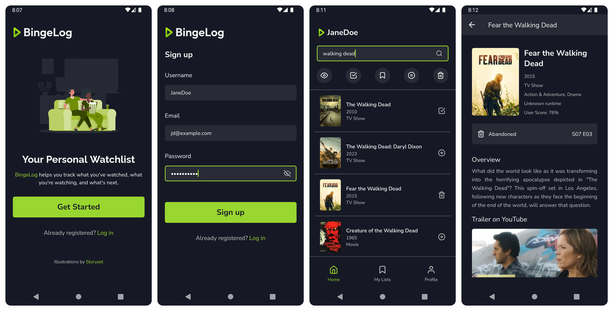

# BingeLog

A React Native mobile application for managing a personal watchlist of movies and TV shows. The app allows users to assign each media item a status and track watching progress.  
Developed to gain a better understanding of frontend–backend interaction.



## Features

- **Personal Watchlist**: Add, edit, and remove movies and TV shows, each stored with a selected status (_Watching_, _Watched_, _To watch_, _On hold_, or _Abandoned_).
- **Progress Tracking**: Record a short text value representing the current watching progress — for example minutes, seasons, episodes, or short notes.
- **Detailed Media View**: Show movie and series details such as poster, overview, release year, genres, and other related information. Progress can be added from this view, and items can be updated in the watchlist.
- **Filtering by Status**: Display only the items that belong to a specific category.
- **User Accounts and Data Storage**: The app uses its own backend and database for user registration, login, and watchlist management. (Media information is fetched from [TMDb](https://www.themoviedb.org/).)

## Technologies Used

### Frontend

- **React Native (Expo):** Cross-platform mobile application framework
- **TypeScript:** Static typing support
- **NativeWind:** Utility-first styling with Tailwind CSS for React Native
- **Jest:** Unit testing framework

### Backend

- **Express.js:** Node.js framework for building REST APIs
- **MySQL:** Relational database management system

### Development Tools

- **VS Code:** Integrated development environment
- **Android Studio:** Emulator and device testing environment
- **XAMPP:** Local server and database environment
- **Postman:** API endpoint testing
- **Figma:** Interface design and layout planning

## Developer Installation

**1. Clone the repository**

```
git clone https://github.com/orszaczkyanna/react-native-bingelog.git
cd react-native-bingelog/bingelog
```

**2. Install frontend dependencies**

```
npm install
```

**3. Set up the frontend environment file**

Create a `.env` file in the project root (`bingelog/.env`) with the following content:

```
EXPO_TMDB_API_KEY=your_tmdb_api_key
```

The TMDb API key is required for fetching movie and series data.  
You can obtain it from [The Movie Database](https://www.themoviedb.org/).

**4. Set up the backend environment file**

Navigate to the backend folder and create a `.env` file (`bingelog/backend/.env`):

```
PORT=4000

DB_HOST=127.0.0.1
DB_USER=root
DB_PASSWORD=''
DB_NAME=bingelog

ACCESS_TOKEN_SECRET=your_access_token_secret
REFRESH_TOKEN_SECRET=your_refresh_token_secret

TMDB_API_KEY=your_tmdb_api_key
```

- The `TMDB_API_KEY` must be the same as the `EXPO_TMDB_API_KEY` used in the frontend.
- To generate the `ACCESS_TOKEN_SECRET` and `REFRESH_TOKEN_SECRET`, run the following command in the terminal (use two different values):

```
node -e "console.log(require('crypto').randomBytes(64).toString('hex'))"
```

**5. Create the database**

Make sure **XAMPP** is running with both **Apache** and **MySQL** services started (or another local server if preferred).  
Use **phpMyAdmin** (or another MySQL client) to import the provided `.sql` file.  
The SQL script automatically creates the `bingelog` database if it does not already exist.

**6. Start the backend server**

```
cd backend
npm install
npm run dev
```

By default, the API runs at http://localhost:4000.

**7. Start the frontend application**

If using an emulator, start it before launching the app.  
Run the following command in a separate terminal from the backend:

```
npx expo start -c
```

- Press `a` to open the app on an Android emulator
- Press `i` to open the app on an iOS simulator
- Or scan the QR code with the **Expo Go** mobile app

## Project Status

The core functionality of the app has been implemented, including user authentication, search, watchlist management, and a detailed media screen.  
Active development has been suspended after completing the main learning goals: gaining a deeper understanding of frontend–backend integration and practicing testing in a real project.

### Completed features

- User registration and login
- Movie and series search
- Add, update, and remove items from the watchlist
- Filter items by status
- Media details view with status and progress controls
- Error and empty state handling
- Core navigation and app structure

### Unimplemented features

- Home screen sections such as _Your Watchlist_ and _Trending Now_
- Dedicated _My List_ tab
- Profile management (edit username, change email, change password, etc.)

## Credits

### External resources

- **[The Movie Database (TMDb)](https://www.themoviedb.org/)**: source of movie and series data
- **[Storyset](https://storyset.com/)**: illustrations used in the project
- **[ChatGPT](https://chatgpt.com/)**: assistance with development and documentation

### Design and feature inspiration

- **[AnimeAddicts](https://animeaddicts.hu/)**: reference for the watchlist category structure
- **[IMDb](https://www.imdb.com/)**: reference for certain visual and layout elements
- **[Aora (by adrianhajdin)](https://github.com/adrianhajdin/aora)**: reference for overall app structure and interaction flow
